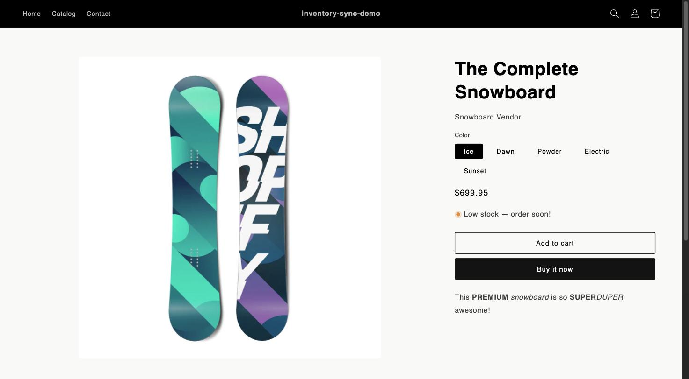
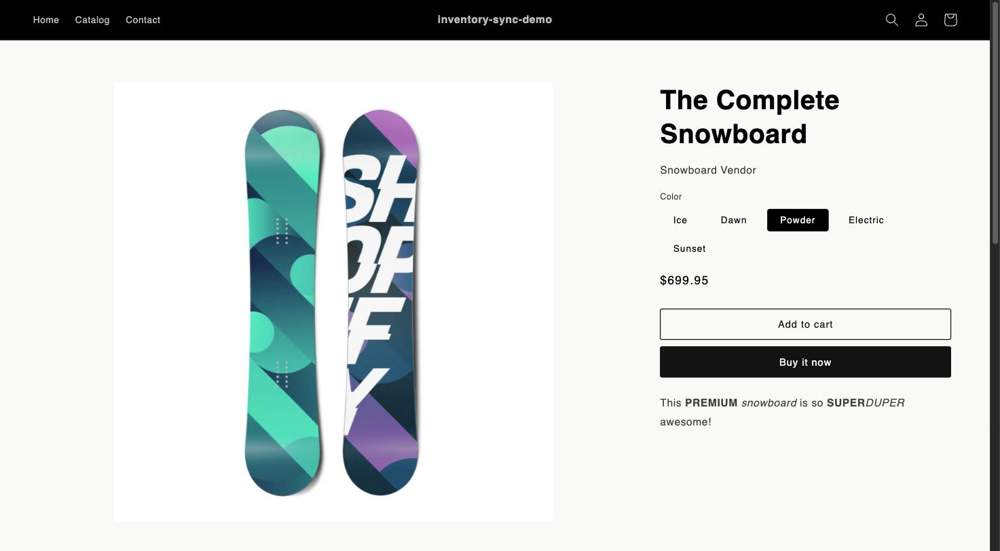
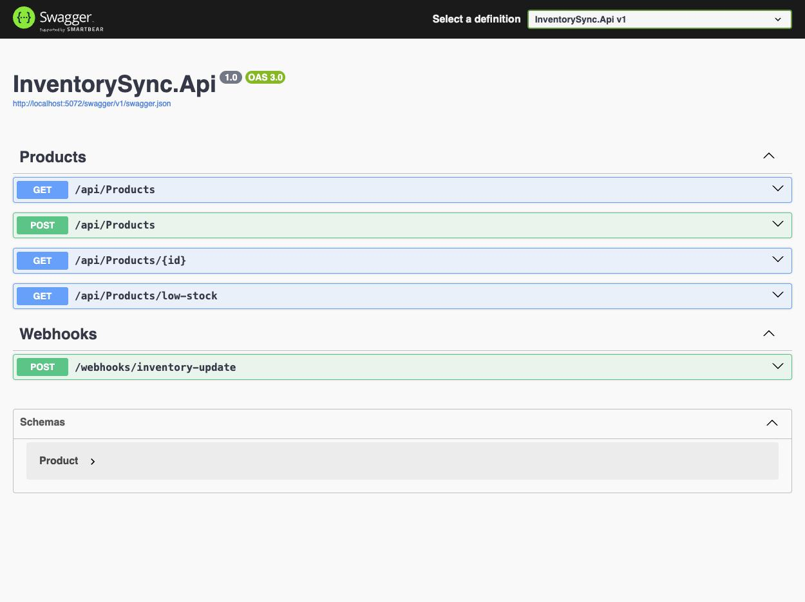

# Shopify Inventory Sync & Storefront Alert

A small, real, working integration: a .NET API that receives Shopify
inventory webhooks, and a Shopify storefront theme customization that
shows live stock status on the product page. Built as a scoped, honest
demo closing real .NET/Shopify skill gaps ahead of applying to a specific
job posting — see `CLAUDE.md` for why this exists and what it does and
doesn't claim, and `PLAN.md` for the full build plan.

Both Phase 1 (.NET backend) and Phase 2 (Shopify storefront integration) are
built and verified live end-to-end against a real Shopify development
store. See "Honest caveats" below for what's simplified or not done.

## What's here

**Backend (.NET)**
- ASP.NET Core 8 Web API, controller-based
- EF Core Code-First models (`Product`, `InventoryLog`) against a SQL
  Server-compatible engine (see caveat below)
- `GET /api/products`, `GET /api/products/{id}`, `POST /api/products`
- `GET /api/products/low-stock` — backed by a real `GetLowStockProducts`
  stored procedure, called via EF Core's `FromSqlRaw` (verified manually,
  not by automated tests — see caveat below)
- `GET /api/products/by-inventory-item/{id}` and
  `GET /api/products/by-variant/{id}` — lookups by Shopify's two different
  identifiers (see "Why two lookup endpoints" below)
- `POST /webhooks/inventory-update` — verifies the `X-Shopify-Hmac-Sha256`
  signature before persisting, using the real Shopify
  `inventory_levels/update` payload shape (`inventory_item_id`, `available`)
- Configured for in-process IIS hosting (`AspNetCoreHostingModel` set to
  `InProcess`, `web.config` generated correctly on `dotnet publish`) —
  demonstrates the app *is* IIS-deployable, but it has **not** actually
  been deployed to or run under a real IIS instance. See caveat below.
- xUnit tests for the CRUD endpoints, the webhook receiver, the HMAC
  verifier, and both lookup endpoints, run against EF Core's InMemory
  provider

**Shopify storefront (Phase 2)**
- A real Shopify Partner account + development store (`inventory-sync-demo`)
- A registered Shopify app (`shopify-app/`, config-only — no app code of
  its own) providing an **App Proxy** (`/apps/inventory/...` → the .NET
  API) and a real **webhook subscription** for `inventory_levels/update`
- A **Cloudflare Quick Tunnel** exposing the local .NET API publicly for
  Shopify to reach — a dev tunnel, not a deployment (see caveat below)
- A "Low Stock Alert" badge (`theme/snippets/low-stock-alert.liquid`),
  rendered as a block inside the theme's `main-product` section right
  after price, styled to match the theme's own native low-stock
  indicator (same dot-icon SVG, same amber color)
- A small JS fetch (`theme/assets/low-stock-alert.js`) that checks status
  through the App Proxy on page load, and re-checks when the shopper
  switches variants (covers both the classic `name="id"` variant field
  and the `variant:change` CustomEvent modern themes dispatch)

**Verified live, end-to-end, in a browser:** changing a variant's
inventory in the real Shopify Admin fires the real Shopify webhook →
hits the tunnel → HMAC-verified with the real signing secret → updates
the SQL Server database → the storefront badge reflects the new state on
reload, correctly, in both directions (shows when low-stock, hides when
not), and reacts correctly to switching between variants without a page
reload.

## Screenshots

**Storefront badge, live on the real dev store** — same product, same
theme, only the selected variant's tracked inventory differs:

| Low stock (quantity at/below threshold) | Normal stock |
|---|---|
|  |  |

**Backend API surface (Swagger UI)** — Products CRUD, the low-stock
report, both lookup endpoints, and the webhook receiver:



## Why two lookup endpoints

Shopify's real `inventory_levels/update` webhook payload carries
`inventory_item_id`, so the webhook receiver keys on
`Product.ShopifyInventoryItemId`. But Shopify's **Liquid** environment
does not expose `variant.inventory_item_id` at all — confirmed live,
including checking the variant's full JSON serialization, it's simply
absent. Liquid does expose `variant.id`, so the storefront badge looks
products up by that instead, via a separate `ShopifyVariantId` field and
the `by-variant` endpoint. Both IDs are set when a product is registered
(see "Registering products" below); the webhook receiver and the
storefront lookup are intentionally two different, independent paths.

## Honest caveats

- **"SQL Server" locally is Azure SQL Edge, not the genuine SQL Server
  engine.** Microsoft's Linux SQL Server container image has no arm64
  build, so this Apple Silicon dev machine runs
  `mcr.microsoft.com/azure-sql-edge` instead, via Colima. Wire-compatible
  (same T-SQL, same EF Core `SqlServer` provider), but a different
  product, and that distinction matters if asked directly.
- **No live IIS deployment.** Configured for IIS's in-process hosting
  model (`web.config` generated correctly by `dotnet publish`), but never
  actually deployed to or run under a real IIS instance — this dev
  environment is macOS, and IIS is Windows-only.
- **The low-stock endpoint is verified manually, not by automated
  tests.** EF Core's InMemory provider can't execute `FromSqlRaw`; see
  "Verifying the low-stock stored procedure" below.
- **The Azure SQL Edge container has no `sqlcmd` tooling at all** —
  `docker-compose.yml`'s healthcheck uses a bash `/dev/tcp` TCP-connect
  probe instead of a `sqlcmd -Q` query.
- **The public URL is a Cloudflare Quick Tunnel, not a deployment.** It's
  a temporary tunnel to `localhost:5072` on this dev machine, and the
  tunnel URL changes every time it restarts — the App Proxy config and
  webhook subscription in `shopify-app/shopify.app.toml` have to be
  updated to match whenever that happens. There is no hosted, permanent
  version of this API running anywhere.
- **App Proxy requests are not signature-verified.** Shopify signs
  proxied requests with a separate signature scheme from webhook HMAC;
  this demo doesn't verify it. Deliberate: the two proxy endpoints are
  read-only and non-sensitive (they only answer "is this low stock,"
  never mutate anything), unlike the webhook receiver, which does mutate
  data and is HMAC-verified.
- **Multi-location inventory isn't correctly aggregated.** Shopify's real
  `inventory_levels/update` payload also carries a `location_id` —
  `available` is the count at *one* location, not a store-wide total.
  This demo's webhook receiver overwrites `Product.Quantity` directly
  from the payload, so a webhook from one location would clobber another
  location's contribution instead of summing them. Found live while
  testing against the dev store's own "Multi-location Snowboard" sample
  product (which really does have inventory split across two
  locations — "Shop location" and "My Custom Location"). Documented here
  as a deliberate, disclosed scope boundary, not fixed: a correct
  implementation would track quantity per `(Product, Location)` and sum
  for the total.
- **The demo store's full catalog was registered via a one-off manual
  script**, not a "sync products from Shopify" feature — there is no
  such feature built. Each `Product` row's `ShopifyInventoryItemId` and
  `ShopifyVariantId` were set by hand (via `POST /api/products`) using
  values looked up through Shopify's Admin API GraphiQL explorer.
- **The dev store keeps its password wall mandatory.** Shopify Partner
  development stores can't have password protection disabled until
  transferred to a paid plan — this isn't something this project chose,
  it's a platform constraint. `shopify theme dev`/`theme editor` previews
  bypass it; a plain browser visit to the storefront needs the password.

## Running locally

### Backend

Requires the .NET 8 SDK and a container runtime (Colima + `docker compose`
on macOS). This project's SDK was installed via Microsoft's install
script rather than a brew cask — see
`docs/superpowers/plans/2026-07-22-phase1-dotnet-backend.md` (Task 1) for
the exact commands.

```bash
cp .env.example .env   # edit in a real password
docker compose up -d
docker compose ps      # wait for the db service to report healthy
export $(grep -v '^#' .env | xargs)
export DOTNET_ROOT="$HOME/.dotnet"; export PATH="$HOME/.dotnet:$PATH"
dotnet ef database update --project src/InventorySync.Api
dotnet run --project src/InventorySync.Api
```

The API listens on `http://localhost:5072`. Swagger UI is at
`http://localhost:5072/swagger` in Development.

**Troubleshooting `dotnet ef`:** if it fails to resolve `libhostfxr.dylib`,
it needs `DOTNET_ROOT` set, not just `PATH` (shown above).

### Shopify storefront (Phase 2)

Requires Node.js, the Shopify CLI (`npm install -g @shopify/cli
@shopify/theme`), and `cloudflared` (`brew install cloudflared`).

```bash
# 1. Expose the local API publicly (URL changes every restart)
cloudflared tunnel --url http://localhost:5072

# 2. Update shopify-app/shopify.app.toml's application_url, app_proxy.url,
#    and the webhook subscription's uri to match the new tunnel URL, then:
cd shopify-app
npx shopify app deploy --allow-updates

# 3. Preview the theme live (asks for the dev store's password)
cd ../theme
npx shopify theme dev --store <your-dev-store>.myshopify.com --store-password "<password>"
```

### Registering products

There's no sync feature — register each product/variant you want
tracked directly:
```bash
curl -X POST http://localhost:5072/api/products -H "Content-Type: application/json" \
  -d '{"shopifyInventoryItemId":<id>,"shopifyVariantId":<id>,"title":"...","sku":"...","quantity":10,"lowStockThreshold":5}'
```
Look up a variant's `inventory_item_id` and `id` via the Shopify Admin
API (e.g. through `shopify app dev`'s local GraphiQL proxy).

## Running tests

```bash
dotnet test tests/InventorySync.Api.Tests
```
Runs against EF Core's InMemory provider — no container needed. The one
thing not covered is the `GetLowStockProducts` stored procedure itself
(InMemory can't execute `FromSqlRaw`); see below.

## Verifying the low-stock stored procedure (manual — not covered by xUnit)

```bash
dotnet run --project src/InventorySync.Api &
sleep 3
curl -s -X POST http://localhost:5072/api/products -H "Content-Type: application/json" \
  -d '{"shopifyInventoryItemId":1,"title":"Low","sku":"LOW","quantity":2,"lowStockThreshold":5}'
curl -s -X POST http://localhost:5072/api/products -H "Content-Type: application/json" \
  -d '{"shopifyInventoryItemId":2,"title":"High","sku":"HIGH","quantity":50,"lowStockThreshold":5}'
curl -s http://localhost:5072/api/products/low-stock
kill %1
```
Expected (and confirmed): the last call returns only the `"sku":"LOW"`
product.

## Verifying the storefront end-to-end (manual — the real Phase 2 test)

With the tunnel, API, and `shopify app deploy` all pointed at each other:
1. Register a real store variant via `POST /api/products` (quantity above
   its threshold).
2. Load that product's page via `shopify theme dev`'s preview — no badge.
3. In Shopify Admin, drop that variant's inventory to at or below the
   threshold.
4. Reload the product page — badge now shows. Switch to a different,
   untracked variant — badge hides. Switch back — badge reappears.

This was run against the dev store's "The Complete Snowboard" product
(the "Ice" variant) and confirmed working in both directions.

## Project layout

```
src/InventorySync.Api/         ASP.NET Core Web API
  Controllers/                 ProductsController, WebhooksController
  Data/                        AppDbContext
  Migrations/                  EF Core migrations (incl. the stored procedure)
  Models/                      Product, InventoryLog, InventoryUpdatePayload, LowStockStatus
  Services/                    ShopifyHmacVerifier
tests/InventorySync.Api.Tests/ xUnit tests (InMemory-backed)
docker-compose.yml             Azure SQL Edge container (local "SQL Server")
shopify-app/                   Shopify app config (App Proxy + webhook), config-only
theme/                         The dev store's pulled theme + the Low Stock Alert addition
docs/superpowers/plans/        Detailed, corrected-after-the-fact build logs
docs/superpowers/specs/        Design docs written before implementation
```

For the full, corrected-after-the-fact record of exactly what commands
were run and what deviated from the original plans, see
`docs/superpowers/plans/` — both plan files were kept up to date as each
task was completed and are the most accurate account of what actually
happened, including several real bugs found and fixed during live
testing (not just what was planned in advance).
